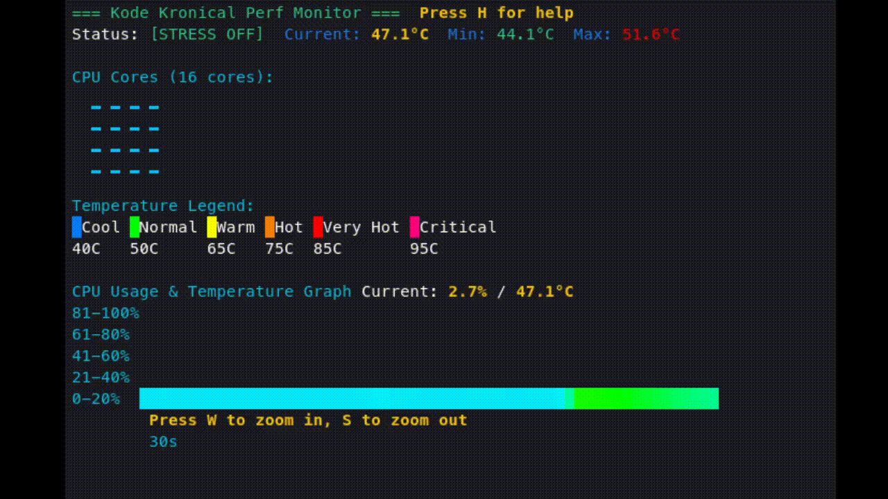
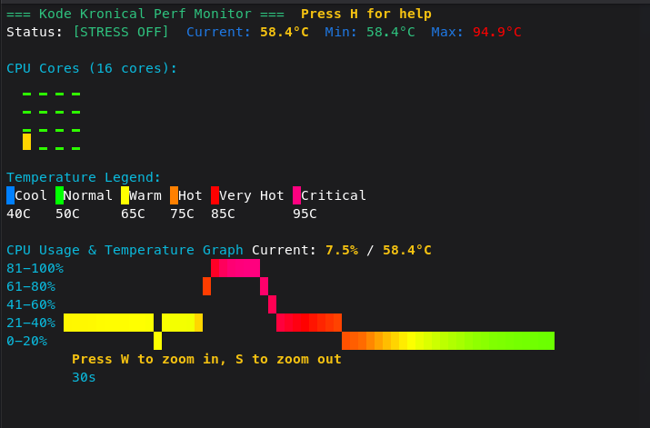

# Kode Kronical Perf Monitor



A real-time CPU performance monitoring application written in Go that provides a colorful, terminal-based interface for tracking CPU usage and temperature.

_Static screenshot:_  


## Features

### Real-time Monitoring
- **CPU Usage Tracking**: Displays total CPU usage and per-core statistics
- **Temperature Monitoring**: Shows current, minimum, and maximum CPU temperatures
- **Color-coded Visualization**: Temperature-based color gradients for easy interpretation
- **Multiple Time Scales**: 30s, 60s, 5min, and 30min viewing windows

### Interactive Display
- **Per-core Bars**: Visual representation of each CPU core's usage with temperature coloring
- **Historical Graph**: Combined CPU usage and temperature history over time
- **Smooth Animation**: 60fps rendering with interpolated values for fluid display
- **Stress Testing**: Built-in CPU stress testing capability

### Controls
- **SPACE**: Toggle CPU stress test ON/OFF
- **W**: Zoom in (shorter time scale)
- **S**: Zoom out (longer time scale) 
- **H**: Toggle help page
- **ESC/Q**: Exit help or quit application
- **Ctrl+C**: Quit application

## Requirements

- Go 1.19 or later
- Linux system with `/proc/stat` and temperature sensors
- Terminal with true color support (24-bit color)
- Terminal size: minimum 80x40 characters (80 columns, 40 rows)
- `stress` command (optional - for stress testing feature)

## Quick Start

The easiest way to build and run the application:

```bash
# Clone the repository
git clone <repository-url>
cd kode_kronical_perf_monitor

# Build and run (simplest method)
./build.sh run
```

## Installation Options

### Option 1: Using Build Script (Simplest)

```bash
# Build and run with automatic dependency checking
./build.sh run

# Just build
./build.sh

# Build optimized static binary
./build.sh static

# Build with debug symbols
./build.sh debug

# Install system-wide
./build.sh install

# Clean build artifacts
./build.sh clean

# Check dependencies only
./build.sh check

# Show all options
./build.sh help
```

### Option 2: Using Makefile

```bash
# Build the application
make

# Build optimized static binary
make build-static

# Build and run with dependency checks
make dev

# Check stress command availability
make check-stress

# Install system-wide
make install

# Uninstall from system
make uninstall

# Show all targets
make help
```

### Option 3: Manual Build

```bash
# Install dependencies (go.mod is included)
go mod tidy

# Build the application
go build -o cpu_monitor cpu_monitor.go

# Run
./cpu_monitor
```

### Option 4: Direct Go Run

```bash
go run cpu_monitor.go
```

## Optional: Install Stress Testing Tool

The stress testing feature is **optional** - the application will run perfectly without it:

```bash
# Ubuntu/Debian
sudo apt install stress

# Arch Linux
sudo pacman -S stress

# CentOS/RHEL
sudo yum install stress
```

If `stress` is not installed, you'll see `[STRESS N/A]` in the status line instead of `[STRESS OFF]`.

## Usage

Run the monitor:
```bash
./cpu_monitor
```

The application will display:
- **Header**: Status information with current, min, and max temperatures
  - Shows `[STRESS OFF]`, `[STRESS ON]`, or `[STRESS N/A]` if stress command unavailable
- **CPU Cores Grid**: Visual bars showing individual core usage and estimated temperatures
- **Temperature Legend**: Color coding reference for temperature ranges
- **Historical Graph**: Time-series view of CPU usage and temperature data

### Graceful Error Handling

The application is designed to run smoothly even when optional components are missing:

- **No stress command**: Shows `[STRESS N/A]` status and disables stress testing
- **Missing temperature sensors**: Falls back to alternative sensor paths
- **Terminal compatibility**: Gracefully handles terminals with limited color support

### Temperature Color Coding

- **Cool (35-45°C)**: Blue shades
- **Normal (45-60°C)**: Green to yellow-green
- **Warm (60-75°C)**: Yellow to orange
- **Hot (75-85°C)**: Orange to red
- **Very Hot (85-95°C)**: Red shades
- **Critical (95°C+)**: Magenta to purple

## Technical Details

### Architecture
- **Polling System**: 500ms intervals for data collection
- **Rendering Engine**: 60fps display updates with smooth interpolation
- **Sample Buffering**: Rolling average calculation for stable readings
- **Multi-scale History**: Adaptive time scales with different update intervals

### Temperature Sources
1. Primary: AMD k10temp sensor via `sensors` command
2. Fallback: Various `/sys/class/hwmon/` and thermal zone sensors

### Performance
- Minimal CPU overhead through efficient polling and rendering separation
- Smooth animations via interpolated values between data points
- Memory-efficient circular buffers for historical data

## Building

The application uses the following Go dependencies:
- `golang.org/x/term` - Terminal control and raw mode support

### Makefile Targets

```bash
make help          # Show all available targets
make               # Build the application  
make build-static  # Build optimized static binary
make deps          # Install/update dependencies
make check-stress  # Check if stress command is available
make run           # Build and run the application
make run-check     # Check dependencies and run
make dev           # Development build with checks
make clean         # Remove build artifacts
make install       # Install system-wide (requires sudo)
make uninstall     # Remove from system
```

### Manual Static Binary

```bash
CGO_ENABLED=0 go build -ldflags="-w -s" -o cpu_monitor cpu_monitor.go
```

## Compatibility

Tested on:
- Linux systems with modern CPUs
- Terminals supporting 24-bit color (most modern terminals)
- AMD and Intel processors

## License

[Add your license information here]

## Contributing

[Add contribution guidelines here]